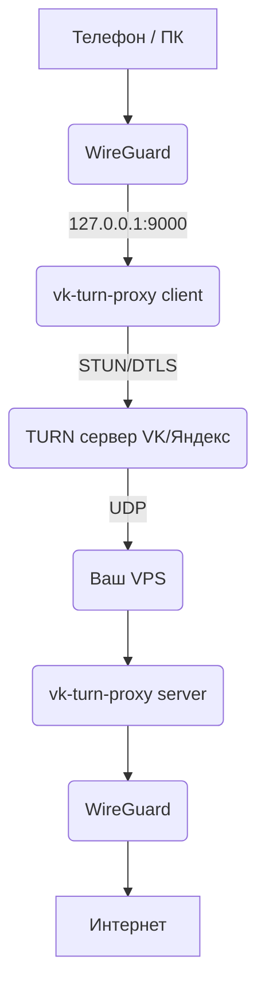

# Good TURN — обход блокировок через TURN-серверы VK и Яндекс

**Только для учебных целей!**

## 📌 Что это такое?

Этот проект позволяет передавать трафик WireGuard или Hysteria через TURN-серверы, используемые в звонках VK (ВКонтакте) и Яндекс.Телемосте.

### 🔧 Как это работает (простыми словами)

1.  Ваш телефон или компьютер шифрует трафик (DTLS 1.2).
2.  Затем он разбивает его на параллельные потоки и отправляет на TURN-сервер VK или Яндекса.
3.  TURN-сервер, думая, что это обычный звонок, пересылает данные на ваш сервер (VPS).
4.  На сервере трафик расшифровывается и передается в интерфейс WireGuard.

Логин и пароль для доступа к TURN-серверу автоматически извлекаются из ссылки на звонок.

---

## 🚀 Настройка (Клиент ↔ Сервер)

Перед началом вам понадобятся:

1.  **Ссылка на действующий звонок:**
    *   **VK:** Создайте звонок в ВК (нужен аккаунт). Ссылка действительна вечно, если не нажать «Завершить звонок для всех». Можно найти готовые ссылки по запросу `"https://vk.com/call/join/"`.
    *   **Яндекс:** Ссылка на Телемост.

2.  **Сервер (VPS):** Любой сервер с установленным WireGuard.

3.  **Клиент:**
    *   Для **Android**: приложения [WireGuard](https://play.google.com/store/apps/details?id=com.wireguard.android) и [VK TURN PROXY](https://github.com/MYSOREZ/vk-turn-proxy-android).
    *   Для **Windows/Linux**: готовые скрипты из этого репозитория.

### 🌍 Схема работы (Client -> Server)


 Ниже готовая схема именно под ваш сценарий:

 ## Настройка сервера

- скачиваем на linux docker.io и docker-compose / на windows docker descktop
- Скачиваем репозиторий
- переходим в `./deploy/server2` и создаем файл `.env` по примеру `.env.example`

#### Основное по env:

- SERVERURL={IP СЕРВЕРА} # указываем ip вашего сервера
- SERVERPORT={PORT} # PORT по которому Wireguard слушает, опционально, можем оставить такие же как в настройках (51820)
- LISTEN_ADDR={IP СЕРВЕРА:PORT} # ip:port по которому слушаем входящий трафик на сервер
- PEERS=1 # кол-во пиров, чем больше, тем быстрее, лучше ставить от 1 до 5, но и 1 достаточно
- CONNECT_ADDR={IP СЕРВЕРА:PORT} # адрес серверного wireguard

- выполняем команду docker-compose up -d --build

- после запуска wireguard создает конфиг по умолчанию и папку ./wireguard-config , выполняем команду `docker logs wireguard` и видим qr код, это наш профиль в wireguard в qr, вернемся к нему после установки


## 📱 Настройка Android

### 1. Установка приложений
Установите из магазина приложений (Google Play / RuStore / Huawei AppGallery) или скачайте официальные APK:
- **[WireGuard](https://www.wireguard.com/install/)** — основной VPN-клиент
- **[VK TURN PROXY](https://github.com/MYSOREZ/vk-turn-proxy-android/releases)** — прокси-клиент для маршрутизации трафика через TURN

### 2. Настройка VK TURN PROXY

Откройте приложение VK TURN PROXY. Вы увидите несколько полей для заполнения:

| Поле | Описание | Пример |
|------|----------|--------|
| **Peer** | IP-адрес и порт вашего сервера (VPS) | `123.45.67.89:56000` |
| **Ссылка Vk Calls** | Ссылка на активный звонок ВКонтакте | `https://vk.com/call/join/abc123...` |
| **Потоки** | Количество параллельных потоков | `1` (можно 2-5 для ускорения) |

> ⚠️ **Важно:** Ссылка на звонок должна быть активной. Если вы создаёте звонок сами, не нажимайте «Завершить звонок для всех» — ссылка будет работать бесконечно.

После заполнения нажмите кнопку **«Запустить»**. Приложение начнёт установку соединения с TURN-сервером VK. Вы должны увидеть статус **«Connected»** или **«Running»** или **«Established DTLS connection!»**.

### 3. Настройка WireGuard

#### 3.1 Импорт конфигурации
- Откройте WireGuard
- Нажмите кнопку **«+»** (добавить туннель)
- Выберите **«Сканировать из QR-кода»**
- Отсканируйте QR-код, который появился в логах вашего сервера (команда `docker logs wireguard`) или импортируйте его файлом

#### 3.2 Редактирование конфигурации
После импорта откройте только что добавленный туннель для редактирования:

1. Нажмите на карандаш ✏️ (редактировать)
2. В разделе **«Пир» (Peer)** найдите поле **«Адрес сервера» (Endpoint)**
3. **Измените** значение на `127.0.0.1:9000`
4. Найдите поле **MTU** и установите значение `1280`
5. **Сохраните** изменения

#### 3.3 Исключение VK TURN PROXY из VPN (важно!)
WireGuard не должен туннелировать трафик самого прокси-приложения, иначе соединение сломается.

1. В окне редактирования туннеля нажмите **«Исключённые приложения»** (Excluded apps)
2. В списке найдите и отметьте **VK TURN PROXY**
3. Нажмите **«Готово»** или галочку для сохранения

### 4. Запуск

1. **Сначала** убедитесь, что VK TURN PROXY показывает статус **«Connected»**
2. **Затем** вернитесь в WireGuard и включите туннель (переключатель в положение **ON**)
3. Проверьте соединение — откройте браузер и перейдите на любой сайт


## 🪟 Настройка Windows

### 1. Подготовка WireGuard

#### 1.1 Установка WireGuard
Скачайте и установите [WireGuard для Windows](https://www.wireguard.com/install/)

#### 1.2 Импорт конфигурации
1. Получите конфигурационный файл с сервера (файл `client_1.conf`)
2. Откройте WireGuard
3. Нажмите **«Import tunnel(s) from file»**
4. Выберите полученный файл

#### 1.3 Редактирование конфигурации
В импортированном конфиге измените следующие параметры:
[Interface]
PrivateKey = ...
Address = 10.0.0.2/32
DNS = 8.8.8.8
MTU = 1280 # ← Установите 1280

[Peer]
PublicKey = ...
AllowedIPs = 0.0.0.0/0, ::/0
Endpoint = 127.0.0.1:9000 # ← Измените на 127.0.0.1:9000
PersistentKeepalive = 25

text

> ⚠️ **Важно:** Не включайте WireGuard до тех пор, пока прокси не установит соединение!

---

### 2. Скачивание прокси-клиента

Скачайте последнюю версию `client-windows.exe`:

🔗 **Ссылка для скачивания:** [https://github.com/cacggghp/vk-turn-proxy/releases/tag/v1.1.1](https://github.com/cacggghp/vk-turn-proxy/releases/tag/v1.1.1)

В разделе **Assets** скачайте файл:
- `client-windows.exe` — для Windows x64
- `client-windows-386.exe` — для Windows x86 (32-бит)

После скачивания разместите файл в удобной папке, например:
C:\good-turn\client.exe

text

> 💡 **Совет:** Переименуйте файл в `client.exe` для удобства использования в командах ниже.

---

### 3. Запуск прокси

#### 3.1 Подготовка PowerShell
1. Нажмите **Win + X** и выберите **«Windows PowerShell (Администратор)»**
2. Перейдите в папку с прокси:
```powershell
cd C:\good-turn
Разрешите выполнение скриптов (если нужно):

powershell
Set-ExecutionPolicy -ExecutionPolicy RemoteSigned -Scope CurrentUser
3.2 Запуск для VK
powershell
.\client.exe -peer 123.45.67.89:56000 -vk-link "https://vk.com/call/join/..." -listen 127.0.0.1:9000 | .\routes.ps1
```
#### 4. Параметры запуска
Параметр	Описание	Пример
- -peer	IP и порт вашего сервера	-peer 123.45.67.89:56000
- -vk-link	Ссылка на звонок ВК	-vk-link "https://vk.com/call/join/..."
- -listen	Локальный адрес для WireGuard	-listen 127.0.0.1:9000
- -turn	Ручное указание TURN-сервера	-turn 5.255.211.241
- -udp	Использовать UDP вместо TCP	-udp
- -n	Количество потоков (1-5)	-n 3

5. Дополнительные опции
🔧 Выбор TURN-сервера вручную
Если автоматическое определение не работает, укажите TURN-сервер вручную:

#### Для VK:

```powershell
.\client.exe -turn 5.255.211.241 -peer 123.45.67.89:56000 -vk-link "..." -listen 127.0.0.1:9000 | .\routes.ps1
```
Для ОК (Одноклассники):

```powershell
.\client.exe -turn 217.20.155.67 -peer 123.45.67.89:56000 -ok-link "..." -listen 127.0.0.1:9000 | .\routes.ps1
```


### 🔍 Проверка работоспособности

- Откройте сайт [2ip.ru](https://2ip.ru) — должен отображаться IP-адрес вашего сервера (VPS)
- Если сайты не открываются, попробуйте:
  - Включить режим **«VPN только для нужных приложений»** в WireGuard
  - Перезапустить оба приложения (сначала прокси, потом WireGuard)
  - Убедиться, что ссылка на звонок всё ещё активна

### ❗ Частые проблемы

| Проблема | Решение |
|----------|---------|
| VK TURN PROXY не подключается | Проверьте ссылку на звонок — возможно, звонок завершён. Создайте новый звонок и обновите ссылку. |
| WireGuard включается, но интернета нет | Убедитесь, что в конфиге WireGuard Endpoint = `127.0.0.1:9000`, а не IP сервера. |
| Ошибки DNS в терминале | Включите режим «VPN только для нужных приложений» в WireGuard. |
| Соединение нестабильное | Увеличьте количество потоков в VK TURN PROXY до 3-5. |

---

**Поздравляю! 🎉** Если всё сделано правильно, ваш трафик идёт через TURN-сервер VK, и вы успешно обходите блокировки.


#
#
#
## Отдельно:

## Docker deployment: server 1 + server 2

Ниже готовая схема именно под ваш сценарий:

- **Сервер 1** поднимает `client` и слушает публичный UDP-порт WireGuard, например `51820/udp`.
- **Сервер 2** поднимает `server`, принимает трафик от сервера 1 на `56000/udp` и передаёт его в локальный WireGuard-контейнер.
- WireGuard-клиенты подключаются к **серверу 1**, а реальные WireGuard-сессии завершаются на **сервере 2**.

### Файлы

- `Dockerfile` — общий multi-stage build для `client` и `server`
- `deploy/server1/docker-compose.yml` — compose для сервера 1
- `deploy/server2/docker-compose.yml` — compose для сервера 2
- `deploy/server1/.env.example` и `deploy/server2/.env.example` — шаблоны переменных окружения

### Запуск на сервере 1

```bash
cd deploy/server1
cp .env.example .env
# отредактируйте PEER_ADDR и VK_LINK
docker compose up -d --build
```

Что нужно указать:

- `PEER_ADDR` — публичный IP/домен **сервера 2** с портом `56000`, например `203.0.113.20:56000`
- `VK_LINK` — ссылка на VK Calls
- `WG_PUBLIC_PORT` — UDP-порт, на который будут подключаться ваши WireGuard-клиенты

### Запуск на сервере 2

```bash
cd deploy/server2
cp .env.example .env
# обязательно выставьте SERVERURL равным публичному IP или DNS сервера 1
docker compose up -d --build
```

Ключевой момент:

- `SERVERURL` в контейнере WireGuard на **сервере 2** должен указывать на **сервер 1**, потому что клиенты подключаются именно туда.
- `CONNECT_ADDR=127.0.0.1:51820` оставляет `vk-turn-proxy server` привязанным к локальному WireGuard-контейнеру.

### Схема трафика

```text
WireGuard client
    |
    | UDP 51820
    v
Server 1: vk-turn-proxy client (Docker)
    |
    | WebRTC/TURN over VK
    v
Server 2: vk-turn-proxy server (Docker)
    |
    | UDP 51820
    v
Server 2: WireGuard container
```

### Примечания

- На **сервере 1** нужно открыть входящий UDP-порт WireGuard, обычно `51820/udp`.
- На **сервере 2** нужно открыть входящий UDP-порт `56000/udp` для `vk-turn-proxy server`.
- Если TCP-режим TURN работает нестабильно, на сервере 1 можно переключить `TRANSPORT_MODE=udp`.
- Если хотите использовать существующий WireGuard на сервере 2 вне Docker, можно не запускать контейнер `wireguard`, а задать `CONNECT_ADDR` на адрес уже существующего сервиса.
